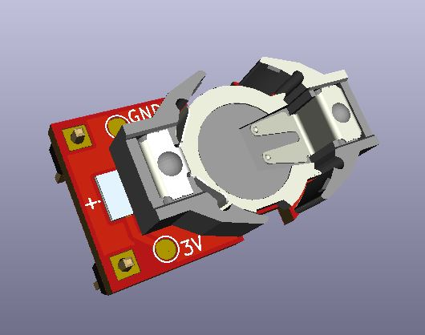

# Amiga-CR1220-Battery
A small CR1220/1225 battery holder for the Amiga and other boards.

## Info
This is a simple Amiga battery replacement design based on dec0de Consulting / LinuxJedi's design, but with a slightly smaller footprint and added test points for voltage measurement. 

## Parts Needed
* The circuit board, from your fabricator of choice. (JLCPCB, PCBway, OSH Park, etc.)
* Renata SMTU1220-LF or SMTU1225-LF battery holder, depending which battery you want to use
* Infineon IRLML6402 or IRLML6401 P-channel MOSFET (SOT-23)
* 3x 1x1-pin 2.54mm male pin headers

## Assembly
* Solder Q1 to the back side of the board.
* Install a single through-hole 2.54mm male pin header on the bottom of the narrow end of the board and flush clip it, then solder.
* Install the battery holder to the SMD pads, paying attention to orientation.
* Install the other two 2.54mm male pin headers to the bottom side of the board and solder them.
* Install the CR1220 / CR1225 battery
* Solder it into your motherboard or expansion card

## Other
Link to dec0de Consulting CR2032 version: https://gitlab.com/dec0de-consulting/amiga-cr2032
